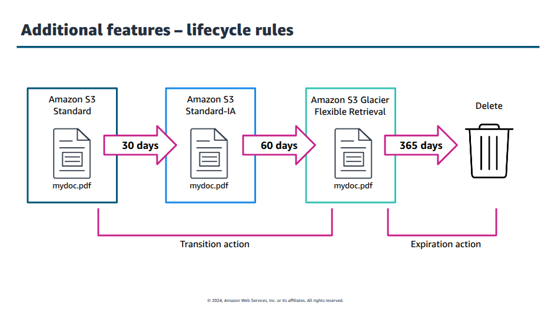

# AWS and Cloud Computing
Concepts of cloud computing using [AWS Educate program](https://aws.amazon.com/education/awseducate/).

## Table of contents
- [Cloud Computing](#cloud-computing)
  - [Definition](#definition)
  - [AWS](#aws)
  - [AWS's suggested path](#awss-suggested-path)
- [Shared Responsability Model](#shared-responsability-model)
- [AWS Core Services](#aws-core-services)
  - [Storage solutions](#storage-solutions)
  - [Interacting with S3 services](#interacting-with-s3-services)

## Cloud Computing
 
### Definition
In simple terms, <b>Cloud Computing</b> involves <i>on-demand deliver</i> IT resources over the internet. IT resources are defined as servers, data storage, software or even services.

These resources can be monetized throught different strategies, but a very common approach is called <b>pay-as-you-go</b>, meaning you pay only for the resources you use, very much like an electricity bill. Because these resources are available remotely, it's easy to increase or even decrease their usage, which reflects on how much you pay or how fast your clients access your application.

### AWS
AWS is the market leader in cloud computing, making it very pertinent to learn it.

Cloud providers such as AWS, Azure and Google Cloud offer different services, in the case of AWS there's around 175 services such as:

* Computation: EC2, Lambda, Lightsail and Batch.
* Storage: S3, EFS, FSx
* Database: DynamoDB, RDS, Amazon QLDB.
* Machine learning: Amazon Redshit, Athena, CloudSearch.

### AWS's suggested path
AWS Educate suggests taking these courses in following order:

1. Getting Started with Storage
2. Getting Started with Compute
3. Getting Started with Networking
4. Getting Started with Databases 
5. Getting Started with Cloud Operations
6. Getting Started with Security
7. Getting Started with Serverless

## Shared Responsability Model
Security is important, and when working with data in the cloud a model of security is often used, <b>Shared responsability model</b>. It builds the foundation of security, compliance and responsabilities between the cloud provider and the user. Different cloud providers implement this model in their own way.

Cloud providers are responsible for what's called security <i>of</i> the cloud. For example: the infrastructure of the data centers, like the buildings, cooling and equipment, servers and networking;  

Although this applicable to the cloud as a whole each service might have a different set of responsabilities. This is one the most important concepts in the security in the cloud: the more managed the service is the more shifts to the cloud provider. This division brings upon three types of services:

1. <b>Infrastructure as a Service (IaaS): </b> service like EC2, is where the user has the most responsabilities, such as applications, permissions, firewall, OS management and more.
2. <b>Platform as a Service (PaaS): </b> services like RDS have almost equal resposability distribution 
3. <b>Software as a Service (SaaS): </b> amazon workmail is managed <i>almost</i> entirely by aws, with small share from the user. 

It's also important to note that in either case, the customer always has some level of responsability, no matter what, and aws doesn't protect against configuration errors or inappropriate security access, for example. 

## AWS Core Services

### Storage solutions
Storage in cloud environments can be define in three type, <b>block storage</b>, <b>file system storage</b> and <b>object storage</b>. Each type has it's use cases and aws provides three services for them, <b>Elastic Block Store</b>, <b>Elastic File System</b> and <b>Simple Storage Service</b>.

#### Elastic Block Store
Designed for EC2 instances, EBS can create storage volumes and attach them to EC2 instances, like a physical unit would. They can be SSD and HDD based with focus and availability and high input/output operations, but limited to EC2 instances and the file system is managed by the user.

#### Elastic File System
Provides access to the same file system by multiple machines or services at the same time. Lot's of use cases, but it's more expensive when compared to block storage.

#### Simple Storage Service
Data is stored as a collection of objects in collections known as buckest. They can be accessed by multiple clients, usually over HTTP. Ideal for static assets, like images and videos, for example. Focused on high volumes, high scalability, but not low latancy.

### Interacting with S3 services
As mentioned before object storage organizes data in objects. An object is composed of:

1. The file you want to store. It can be of any format, but in the case of aws it must have a size of 5TB max.
2. Metadata about the file, like the file format, last modified date etc.
3. A key that serves as a unique identifier for that object.

Objects are placed inside containers called buckets, which are created inside a region. And the combination of a bucket name and the object's id provides a way to interact with the data. A bucket can store unlimited data.

Depending on your access requirements it's possible to classify object storage in two categories:

* <b>Active storage: </b> for data that needs to be frequently accessed or, at least, that it needs to accessed fast, such as static webiste files, images or backups.
* <b>Archive storage: </b> for data that is rarely accessed, but it needs to be maintained.

There's many classes for each type of storage and the user's requirements, from readly available, fast access to rarely accessed data that can be delivered in minutes or even a couple of hours. Once an object is placed uploaded to a bucket it can be managed, by making copies, transfering it, deleting and much more.

It's possible to setup life cycle rules for the objects you store, like the following image:

### EC2 - Elastic Compute Cloud
Amazon's <b>Elastic Compute Cloud</b> provides compute capacity from the cloud. It acts like a remote computer, where you can request access to hardware-specific resources, like CPU power and RAM, so you can run applications or servers remotely, without having a physical machine. This is one of the most important resources provided by AWS, because with that you don't need to worry about scaling your resources if access to a service increases, for example. This scalability is vital not only for EC2, but for any other cloud service. With a EC2 instance you can quickly setup a CPU, RAM, storage and an operating system specifically for you needs and scale it up and down dynamically, without terminating the instance. EC2 instances live inside your VPC.

### VPC - Virtual Private Cloud
Amazon's <b>Virtual Private Cloud</b> (VPC) is a service that allows you to create and manage a <i>virtual network</i>, where you can launch and connect different AWS resources, services or components privately. It behaves like a local network you would have on-premises. With it you can create multiple sub-networks, setup priviledge access, monitor security and much more.

### RDS - Relational Database Service
Amazon's <b>Relational Database Service</b> (RDS) is a cloud service for managing relational databases, providing automatic backup, patching and security features. Like the EC2 instance it can be scaled up or down as the demand changes. You can choose a DB engine, like PostgreSQL or MySQL and let AWS manage software updates, security patches and service maintenance. You can even setup multiple RDS instances for the same DB and, if one fails the other assumes the load